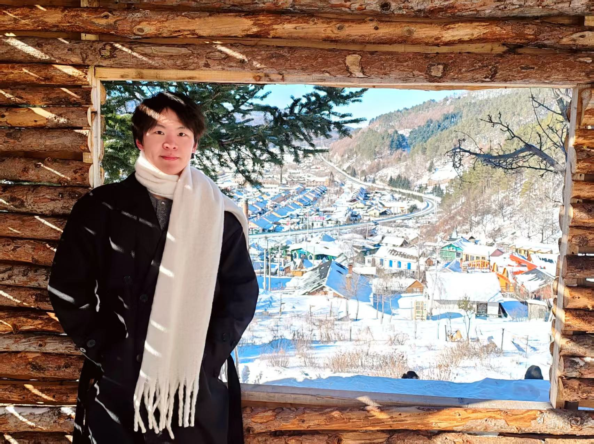

# About Me

Here is **Zichen Zhu (Chris, 朱子琛)**. 

I am an undergraduate student majoring in **Communication Engineering** at the School of [Computer Science and Engineering](http://www.cse.neu.edu.cn/), [Northeastern University, China](https://www.neu.edu.cn/). 

My academic journey is driven by a strong interest in bridging theoretical knowledge with practical innovation in modern communication technologies, as well as a profound curiosity for developing, applying, and integrating modern artificial intelligence (AI)-related technologies with my academic discipline.

## Research Interests

- [Internet of Everything](https://scholar.google.com/citations?view_op=search_authors&hl=zh-CN&mauthors=label:internet_of_everything)
- Embodied Intelligence
- Multimodal Large Language Model
- Vision-Language-Action Model
- Object Detection and Recognition

## Projects

- [基于数据结构理论开发的综合性校园（NEU）服务可视化系统](https://github.com/Tassel51/Smart-Campus-Life-Assistant.git)
- [“灵犀”-多模态-双臂-移动机器人](https://tassel51.github.io/blogs/robot.md)
- [Language-Modeling-from-Scratch-based-on-Stanford-CS336 自己搭建transformer](https://github.com/Tassel51/Language-Modeling-from-Scratch-by-Tassel51)

## News and Updates

- **Aug 2023：** I am very glad to have received the admission notice for the Electronic Information Engineering at Northeastern University! See you in Shenyang!

 

<!-- 这是twitter可视化模块，有点太高级了，用不了 -->

<!-- 
<blockquote class="twitter-tweet">
Thrilled to be an AAAI-UC Scholar at <a href="https://twitter.com/hashtag/AAAI24?src=hash&ref_src=twsrc%5Etfw">#AAAI24</a>, thanks to <a href="https://twitter.com/hashtag/AAAI?src=hash&ref_src=twsrc%5Etfw">#AAAI</a> & <a href="https://twitter.com/hashtag/GoogleExploreCSR?src=hash&ref_src=twsrc%5Etfw">#GoogleExploreCSR</a> for the sponsorship. Grateful for the knowledge gained and new friendships formed.  Wonderful trip in Vancouver. Looking forward to staying connected with all.<a href="https://twitter.com/hashtag/AAAI24?src=hash&ref_src=twsrc%5Etfw">#AAAI24</a> <a href="https://twitter.com/hashtag/Vancouver?src=hash&ref_src=twsrc%5Etfw">#Vancouver</a> <a href="https://twitter.com/hashtag/GoogleExploreCSR?src=hash&ref_src=twsrc%5Etfw">#GoogleExploreCSR</a> <a href="https://t.co/wUQUp8XlSM">pic.twitter.com/wUQUp8XlSM</a>
— Hanlin CAI (seeking a PhD position 2025) (@lancecai2002) <a href="https://twitter.com/lancecai2002/status/1762210025173344260?ref_src=twsrc%5Etfw">February 26, 2024</a></blockquote> 
 -->

